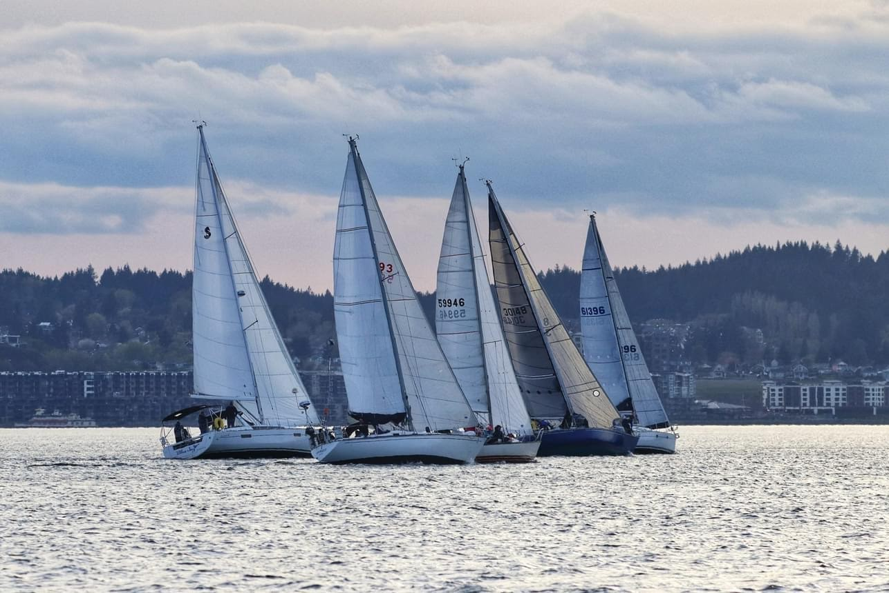

# Regatta
Software for scoring sailing regattas utilizing [PHRF](https://www.ussailing.org/competition/offshore/phrf/) scoring.
Developed by William Kamp of SV Waymaker for the [Corinthian Yacht Club of Tacoma](https://cyct.com/).



### Build and run 
```shell
cd database
docker-compose up
```
```shell
./gradlew :server:run
```

### Run in browser hot loading
```shell
cd database
docker-compose up
```
```shell
./gradlew :server:run
```
(todo: this is broken)
```shell
./gradlew :web:jsRun --continuous
```

### Run in container 
```shell
cd database
docker-compose up
```

```shell
./gradlew makeImg
docker run --network=host ghcr.io/manimaul/regatta:latest
```

### Useful links:
- [Use Kotlin Code from JS](https://kotlinlang.org/docs/js-to-kotlin-interop.html)
- [JavaScript modules](https://kotlinlang.org/docs/js-modules.html)
- [webpack bundling](https://kotlinlang.org/docs/js-project-setup.html#webpack-bundling)
